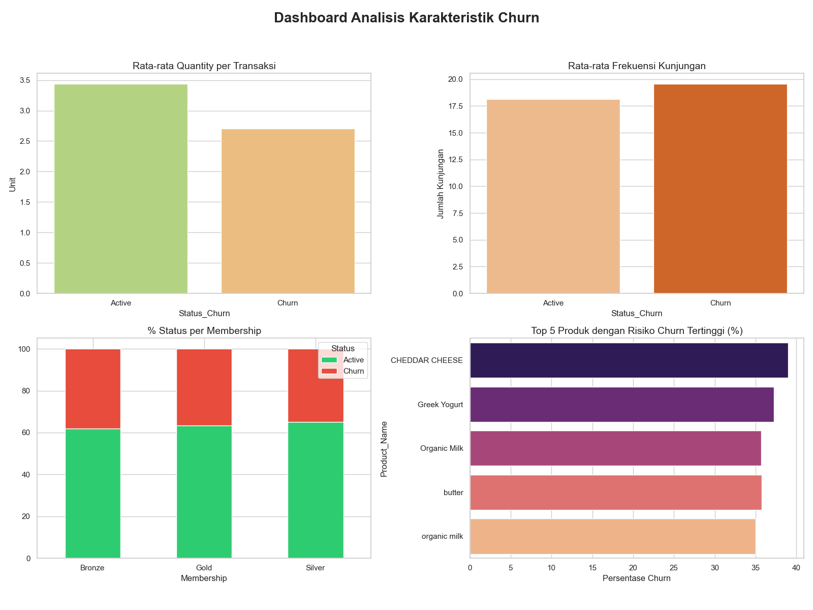
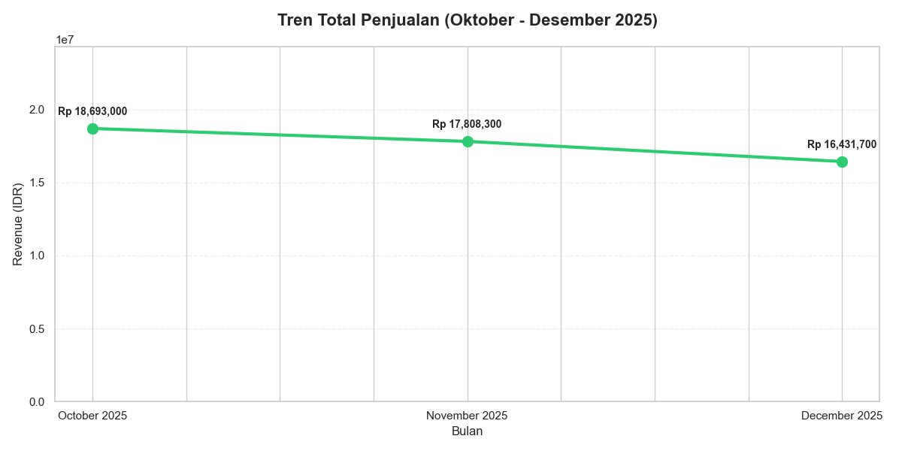

# 🛒 Retail Data Audit & Churn Insight

## 📌 Project Overview
Analisis perilaku *churn* pelanggan retail menggunakan **Synthetic Dataset**. Fokus pada integrasi data, audit (outlier handling), dan penemuan insight bisnis.

## 📊 Analisis Visual

### 1. Karakteristik Pelanggan Churn

> **Insight**: Visualisasi ini menunjukkan bahwa pelanggan yang berhenti (*churn*) cenderung memiliki rata-rata kuantitas barang per transaksi yang lebih kecil dibandingkan pelanggan aktif, meskipun frekuensi kunjungannya hampir sama (*low basket size*).

### 2. Tren Performa Penjualan

> **Insight**: Tren performa penjualan menunjukkan pergerakan yang stabil dari bulan ke bulan. Hal ini menandakan tidak ada masalah operasional toko yang drastis, sehingga fokus retensi bisa diarahkan pada pelayanan pelanggan.

## 📂 Struktur Folder
* 📁 `notebooks/`: File kodingan utama (`.ipynb`).
* 📁 `images/`: Hasil visualisasi dashboard & tren.

---
📓 **Lihat Kodingan**: [main.ipynb](./notebooks/main.ipynb)
